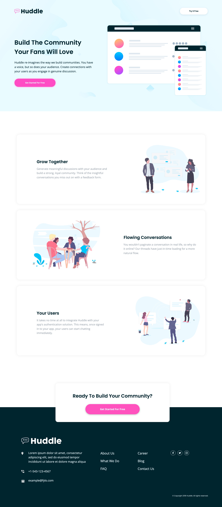

# Frontend Mentor - Huddle Landing Page with Alternating Feature Blocks Solution

This is a solution to the [Huddle landing page with alternating feature blocks challenge on Frontend Mentor](https://www.frontendmentor.io/challenges/huddle-landing-page-with-alternating-feature-blocks-5ca5f5981e82137ec91a5100). Frontend Mentor challenges help you improve your coding skills by building realistic projects. 

## Table of contents

- [Overview](#overview)
  - [The challenge](#the-challenge)
  - [Screenshot](#screenshot)
  - [Links](#links)
- [My process](#my-process)
  - [Built with](#built-with)
  - [What I learned](#what-i-learned)
  - [Useful resources](#useful-resources)
- [Author](#author)

## Overview

### The challenge

Users should be able to:

- View the optimal layout for the site depending on their device's screen size
- See hover states for all interactive elements on the page

### Screenshot



### Links

- Solution URL: [https://www.frontendmentor.io/solutions/huddle-landing-page-challenge-hub-using-css-grid-flexbox-and-functions-i-qO5DQJ_]
- Live Site URL: [https://coder-txane.github.io/Huddle-Landing-Page-Challenge-Hub/]

## My process

### Built with

- Semantic HTML5 markup
- CSS custom properties
- Flexbox
- CSS Grid
- Mobile-first workflow

### What I learned

A major learning I discovered was the importance of mobile-first design. In the past I always started with building larger screens before moving to smaller devices and this has usually made the project more difficult to work with when involving responsive design. However, using this bottom-up approach allowed me to adjust easier when going onto building larger screens from mobile. I will definitely be using this progressive enhancement approach in future projects.

Moreover, towards the end of the project I encountered an issue where the social icons in the footer section would not respond, despite them having a :hover effect and other decalarations in the CSS. When using Google DevTools, I was able to see where the problem arose, which was the fact that for some reason the css body had overlapped the footer area, likely because I had moved the footer upwards relative from its position to fit the design. I had tried moving the footer's z-index forward but that didn't work. It was until then I realised that I needed to set the body's height. Thus, I set it to 100vh and it quickly fixed the problem at hand.

```css
body {
    height: 100vh;
}
```

```css
.circle:hover,
.circle:focus {
    filter: invert(48%) sepia(75%) saturate(2044%) hue-rotate(294deg) brightness(100%) contrast(102%);
    cursor: pointer;
    border-color: var(--pink);
}
```

### Useful resources

- [CSS Filter Generator](https://codepen.io/sosuke/pen/Pjoqqp) - This helped me convert hex colors to CSS filters in order to recolor SVG icons used in this challenge. I really liked using this site and will use it going forward.
- [Google DevTools](https://developer.chrome.com/docs/devtools/) - This is an amazing tool which helped me get to the bottom of my webpage. I'd recommend it to anyone who encounters a roadblock in their code and wants to diagnose problems quickly.

## Author

- Frontend Mentor - [@coder-txane](https://www.frontendmentor.io/profile/yourusername)
 
